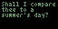

# Slow Shakespeare

[](LICENSE)

Learn Shakespeare's sonnets through daily repetition — one new line per day over 14 days.

<p align="center">
  
</p>

## How It Works

Each day reveals one new line of a sonnet. By day 14, you've memorized the whole poem — then it auto-advances to the next one. Ten sonnets are included: 1, 18, 29, 30, 55, 73, 104, 116, 130, and 138.

## Platforms

### Web — [slowshakespeare.com](https://slowshakespeare.com)

A progressive web app (PWA) that works on any device. Add to your home screen for a native app experience.

Features:
- **Review mode** — auto-animate through learned lines
- **6 color themes** + dark/light mode
- **Share links** — sync learning with friends
- **Offline support** — works without internet once installed

- **Code:** [`web/`](web/)

### Tidbyt

A retro 64x32 LED display that shows your current line. Submitted to the [Tidbyt Community](https://github.com/tidbyt/community) app store.

- **Code:** [`tidbyt/`](tidbyt/)
- **Setup:** See [`tidbyt/README.md`](tidbyt/README.md)

### iOS (Planned)

A Home Screen widget showing today's line. Coming soon.

## Prerequisites

- Python 3.6+
- [Pixlet CLI](https://github.com/tidbyt/pixlet) (for Tidbyt development)

## Development

```bash
# Web — open locally
open web/index.html

# Web — run tests
python3 web/test_slowshakespeare_web.py

# Tidbyt — live preview
pixlet serve --watch tidbyt/slow_shakespeare.star

# Tidbyt — run tests
python3 tidbyt/test_slow_shakespeare.py
```

## License

[Apache 2.0](LICENSE)
